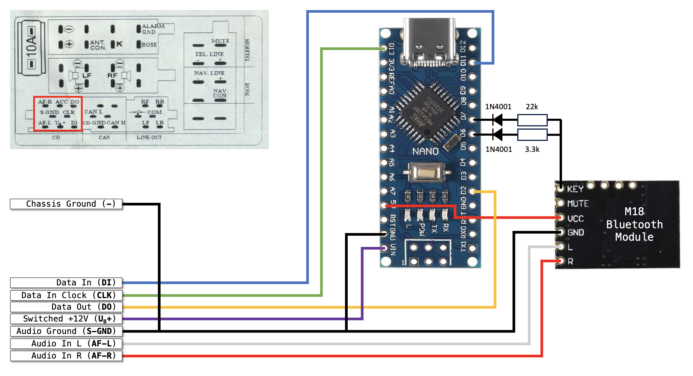

# Audi CD Changer Emulator
This project is for an Arduino-based CD Changer (CDC) emulator that allows a Bluetooth-connected phone (or other audio source) to play on an Audi Concert head unit.

Factory stereos in late 90's or early 2000's Audis can't play streaming music from your phone. Cassette adapters and FM transmitters are one solution, but they're cumbersome and typically have sub-optimal sound quality.

If your car came with a trunk-mounted CDC (or you can use a VAG-COM tool to configure the head unit to work with one), you can use this project to enable the line-level inputs normally used by the CDC. In my case I used a Bluetooth audio module to stream audio from my phone, but it can also work with signals from a headphone jack, etc. In addition enabling the inputs, certain key presses are also detected so that next and previous track functions can be triggered fro the head unit.

# Physical Connections & Physical Layer Protocols
The Concert head unit (HU) has three connector pins used for communication with the CDC, all are digital lines that are either 0v or +5v.

## CDC to HU
Data sent from the CDC to HU uses a simplified from of the Serial Peripheral Interface (SPI) protocol. The CDC acts as the central (_formerly known as the Master_) and the HU acts as a peripheral (_formerly known as a Slave_). When it wants to send data, the CDC generates a clock signal to indicate when data on the data line is valid, and it sets the data line to 0v or +5v to indicate a 0 or 1 bit as needed; the HU reads the data bit on the falling edge of the clock pulse. Since the CDC communicates with just one HU, there is no need for a select or enable line that is used on SPI systems with multiple peripherals.

## HU to CDC
While you might expect HU to CDC signalling to also be SPI, it turns to be an entirely different protocol loosely based on infrared remote controls and fully independent of the other clock and data lines. The HU generates pulses on the data line, and varies the time the line is held high vs. low to signal the start of each frame and the individual bits.

Each command is sent as a frame of 4 bytes, with a special lead pulse to signal the start of the frame, and an extra pulse at the end to complete the cycle (without it, there'd be not way of knowing how long the last data bit pulse had been held low).

// TODO Add diagram

# Hardware
For the hardware, I chose an *[Arduino Nano clone](https://www.amazon.com/gp/product/B0713XK923)* to communicate with the HU, and an *[M18 Bluetooth module](https://www.amazon.com/gp/product/B07W4PJ469)* to wireless connect to my phone and stream audio. Both boards are very inexpensive, readily available, and easy to use.

The Nano's SPI pins (MOSI and SCK) and digital input pin 2 (which can trigger interrupts) are connected directly to the CDC's data communication pins since everything conviniently operates on 5v logic. The Nano is directly powered from a +12V line that is active only when the HU is on (thus ensuring that the hardware won't drain the car's battery or maintain a Bluetooth connection when the HU is off).

The M18 Bluetooth module provides line level audio out that can be fed directly to the HU's audio input pins. It also supports basic keys for controlling playback. The **KEY** input is npulled up to 3.4V by an internal 26k resistor, and needs to be pulled down with a suitable resistor to 0v (On/Off), 0.9v (Prev), 1.8v (Next), or 2.5V (Pause/Play). Two digital output pins on the Nano are connected via diodes and suitably sized resistors to trigger the Next and Prev key functions (note that the resistor values differ from those specified in the M18 specs to account for the additional 0.7v drop across the diodes). The M18 Bluetooth module is powered by the Nano's built in 5V regultor.

